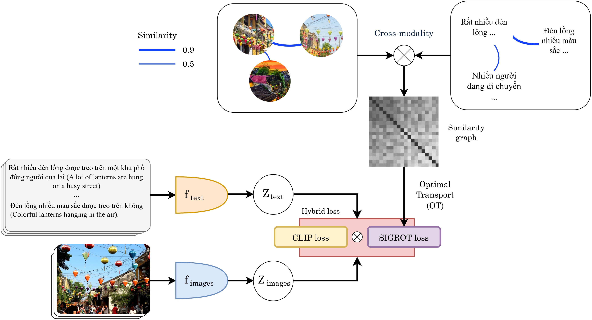
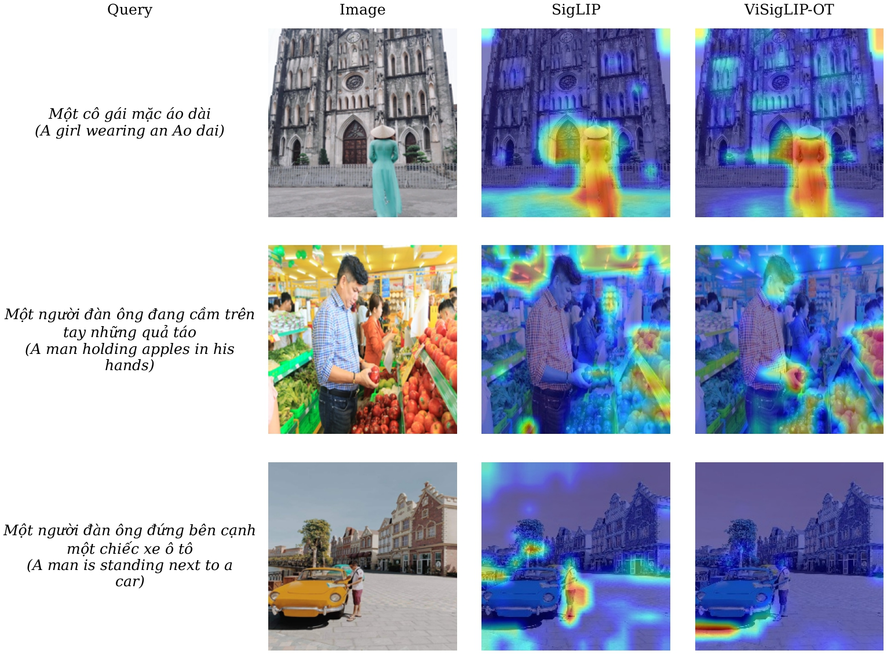
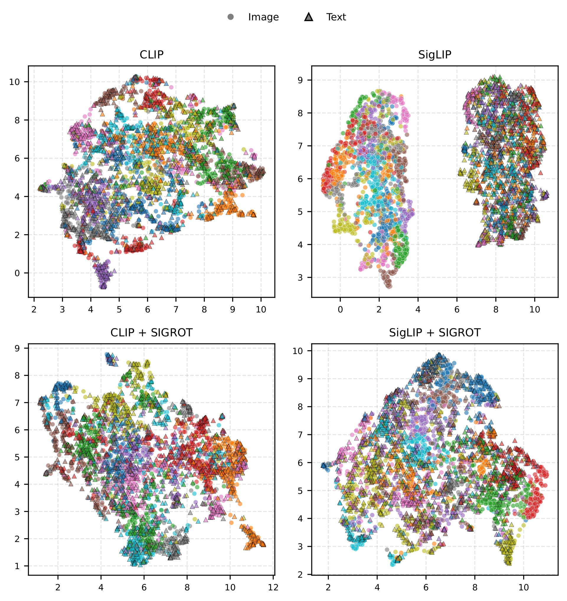

# ViCLIP-OT &mdash; The First Foundation Vision-Language Model for Vietnamese Image–Text Retrieval with Optimal Transport

<p>
  <a href="https://arxiv.org/abs/1234.56789"></a>
  <a href="https://www.python.org"></a>
  <a href="https://pytorch.org"></a>
  <a href="https://github.com/minhnguyent546/ViCLIP-OT/blob/main/LICENSE"></a>
</p>

---

<p align="center">
  
</p>

> **Abstract:** Image-text retrieval has become a fundamental component in intelligent multimedia systems; however, most existing vision-language models are optimized for high-resource languages and remain suboptimal for low-resource settings such as Vietnamese. This work introduces ViCLIP-OT, a foundation vision-language model specifically designed for Vietnamese image-text retrieval. The proposed framework integrates CLIP-style contrastive learning with a Similarity-Graph Regularized Optimal Transport (SIGROT) loss to enhance global cross-modal consistency and mitigate modality gap issues. Extensive experiments on three Vietnamese benchmarks (UIT-OpenViIC, KTVIC, and Crossmodal-3600) demonstrate that ViCLIP-OT consistently outperforms CLIP and SigLIP baselines in both in-domain and zero-shot settings. On UIT-OpenViIC, the model achieves an average Recall@K of 67.34\%, improving upon CLIP by 5.75 percentage points. In zero-shot evaluation on Crossmodal-3600, ViCLIP-OT surpasses CLIP by 11.72 percentage points. Embedding-space analysis further confirms improved alignment and reduced modality gap. The results indicate that integrating SIGROT provides an effective and scalable strategy for cross-modal retrieval in low-resource languages, offering practical implications for intelligent multimedia retrieval systems in Vietnamese and other underrepresented linguistic contexts.

---

Table of Contents
=================

- [ViCLIP-OT — The First Foundation Vision-Language Model for Vietnamese Image–Text Retrieval with Optimal Transport](#viclip-ot--the-first-foundation-vision-language-model-for-vietnamese-imagetext-retrieval-with-optimal-transport)
- [Table of Contents](#table-of-contents)
  - [Highlights](#highlights)
  - [1. Pretrained models](#1-pretrained-models)
  - [2. Quantitative Results](#2-quantitative-results)
    - [2.1 Image-text retrieval results](#21-image-text-retrieval-results)
    - [2.2 Zero-shot image–text retrieval results on KTVIC and Crossmodal-3600](#22-zero-shot-imagetext-retrieval-results-on-ktvic-and-crossmodal-3600)
  - [3. Qualitative Results](#3-qualitative-results)
    - [3.1 Visual Interpretability of Retrieval](#31-visual-interpretability-of-retrieval)
    - [3.2 Visualization of Embedding Space](#32-visualization-of-embedding-space)
  - [4. Getting Started](#4-getting-started)
    - [4.1 Installation](#41-installation)
      - [Prerequisites](#prerequisites)
      - [Setup](#setup)
    - [4.2 Datasets](#42-datasets)
      - [Dataset structure](#dataset-structure)
      - [Remove near-duplicate images](#remove-near-duplicate-images)
      - [Precompute image and caption embeddings](#precompute-image-and-caption-embeddings)
    - [4.3 Training](#43-training)
    - [4.4 Inference](#44-inference)
  - [5. License](#5-license)
  - [6. Citing](#6-citing)

<!-- Created by https://github.com/ekalinin/github-markdown-toc -->

## Highlights

- ViCLIP-OT is the first large-scale vision-language model specifically developed for Vietnamese image-text retrieval.
- ViCLIP-OT combines CLIP-style contrastive learning with a novel similarity-graph regularized optimal transport (SIGROT) loss to enhance cross-modal alignment.
- ViCLIP-OT achieves state-of-the-art performance on three Vietnamese image-text retrieval benchmarks, demonstrating strong zero-shot generalization.
- The proposed SIGROT loss effectively captures global relational structure among samples, improving retrieval accuracy. Furthermore, it reduces the *modality gap* between image and text embeddings and promotes better cross-modal alignment in the shared latent space.

## 1. Pretrained models

Pretrained checkpoints, configuration files, and training logs are available for download:

|    Model    |                                                   Checkpoint link                                                   |                           Config                           |                                                  Training log                                                  |
| :---------: | :-----------------------------------------------------------------------------------------------------------------: | :--------------------------------------------------------: | :------------------------------------------------------------------------------------------------------------: |
|  ViCLIP-OT  |   🤗 [Hugging Face](https://huggingface.co/minhnguyent546/ViCLIP-OT-checkpoints/blob/main/viclip_ot/viclip_ot.pth)   |    [config](./config/model.vit_base_dinov3_sbert.yaml)     |  [training log](https://huggingface.co/minhnguyent546/ViCLIP-OT-checkpoints/blob/main/viclip_ot/training.log)  |
| ViSigLIP-OT | 🤗 [Hugging Face](https://huggingface.co/minhnguyent546/ViCLIP-OT-checkpoints/blob/main/visiglip_ot/visiglip_ot.pth) | [config](./config/model.vit_base_dinov3_sbert_siglip.yaml) | [training log](https://huggingface.co/minhnguyent546/ViCLIP-OT-checkpoints/blob/main/visiglip_ot/training.log) |
|    CLIP     |        🤗 [Hugging Face](https://huggingface.co/minhnguyent546/ViCLIP-OT-checkpoints/blob/main/clip/clip.pth)        |    [config](./config/model.vit_base_dinov3_sbert.yaml)     |    [training log](https://huggingface.co/minhnguyent546/ViCLIP-OT-checkpoints/blob/main/clip/training.log)     |
|   SigLIP    |      🤗 [Hugging Face](https://huggingface.co/minhnguyent546/ViCLIP-OT-checkpoints/blob/main/siglip/siglip.pth)      | [config](./config/model.vit_base_dinov3_sbert_siglip.yaml) |   [training log](https://huggingface.co/minhnguyent546/ViCLIP-OT-checkpoints/blob/main/siglip/training.log)    |
|   SIGROT    |      🤗 [Hugging Face](https://huggingface.co/minhnguyent546/ViCLIP-OT-checkpoints/blob/main/sigrot/sigrot.pth)      |    [config](./config/model.vit_base_dinov3_sbert.yaml)     |   [training log](https://huggingface.co/minhnguyent546/ViCLIP-OT-checkpoints/blob/main/sigrot/training.log)    |

ViCLIP-OT models can also be used via Transformers:

<details>
    <summary>Example usage with Transformers</summary>

```bash
pip install \
    'transformers>=4.57.3,<5.0.0' \
    'torch>=2.8.0,<2.10.0' \
    'torchvision>=0.23.0,<0.25.0' \
    timm \
    pillow
```

```python
from transformers import AutoModel, AutoProcessor
import torch

# Initialize the model
device = torch.device('cuda' if torch.cuda.is_available() else 'cpu')
print(f'Using device: {device}')
model = AutoModel.from_pretrained('minhnguyent546/ViSigLIP-OT', trust_remote_code=True)
model.to(device)

# Example images and sentences
image_uris = [
    'http://images.cocodataset.org/train2014/COCO_train2014_000000138621.jpg',
    'http://images.cocodataset.org/train2014/COCO_train2014_000000190580.jpg',
]
sentences = [
    'Một con mèo màu trắng',
    'Một con mèo màu đen',
    'Một cô gái đang lướt sóng',
]

# Encode text
text_embeddings = model.encode_text(
    sentences=sentences,
    batch_size=32,
    show_progress_bar=True,
    convert_to_tensor=True,
    normalize=True,
    padding=True,
    truncation=True,
    max_length=512,
)

# Encode images
image_embeddings = model.encode_image(
    images=image_uris,
    batch_size=32,
    show_progress_bar=True,
    convert_to_tensor=True,
    normalize=True,
)

# Compute cosine similarity between image and text embeddings
similarities = image_embeddings @ text_embeddings.T
print(similarities)

# tensor([[ 0.0677, -0.0673,  0.5587],
#         [ 0.2560,  0.4277,  0.0467]])
```
</details>

For example inference with Transformers, refer to [example_inference.ipynb](./notebooks/example_inference.ipynb).

## 2. Quantitative Results

### 2.1 Image-text retrieval results

The table below summarizes retrieval performance on the UIT-OpenViIC test set. Both models also substantially outperform pretrained multilingual vision-language models evaluated in a zero-shot setting.

<table>
  <caption>
    <strong>Table:</strong> Image-text retrieval performance on the test set of the UIT-OpenViIC dataset. UOT denotes Unbalanced Optimal Transport. * indicates zero-shot evaluation. Best results are in bold and second-best are underlined.
  </caption>
  <thead>
    <tr>
      <th rowspan="2">Method/Model</th>
      <th rowspan="2"># Params</th>
      <th colspan="3">Text → Image</th>
      <th colspan="3">Image → Text</th>
      <th rowspan="2">Avg.</th>
    </tr>
    <tr>
      <th>R@1</th>
      <th>R@5</th>
      <th>R@10</th>
      <th>R@1</th>
      <th>R@5</th>
      <th>R@10</th>
    </tr>
  </thead>
  <tbody>
    <tr>
      <td>mSigLIP-base*</td>
      <td>370M</td>
      <td>14.34</td>
      <td>28.94</td>
      <td>36.21</td>
      <td>20.49</td>
      <td>32.23</td>
      <td>37.43</td>
      <td>28.27</td>
    </tr>
    <tr>
      <td>Jina CLIP v2*</td>
      <td>865M</td>
      <td>30.01</td>
      <td>52.09</td>
      <td>61.70</td>
      <td>40.23</td>
      <td>65.02</td>
      <td>74.41</td>
      <td>53.91</td>
    </tr>
    <tr>
      <td>Jina Embedding v4*</td>
      <td>4B</td>
      <td>23.97</td>
      <td>42.22</td>
      <td>50.29</td>
      <td>41.48</td>
      <td>66.77</td>
      <td>75.61</td>
      <td>50.06</td>
    </tr>
    <tr>
      <td>Qwen3-VL-Embedding-2B*</td>
      <td>2B</td>
      <td>32.13</td>
      <td>54.00</td>
      <td>62.93</td>
      <td>39.83</td>
      <td>66.52</td>
      <td>77.01</td>
      <td>55.40</td>
    </tr>
    <tr style="border-top: 2px solid #000;">
      <td>CLIP</td>
      <td>221M</td>
      <td>31.19</td>
      <td>59.80</td>
      <td>71.23</td>
      <td>46.60</td>
      <td>75.53</td>
      <td>85.19</td>
      <td>61.59</td>
    </tr>
    <tr>
      <td>SigLIP</td>
      <td>221M</td>
      <td>34.75</td>
      <td>63.01</td>
      <td>72.96</td>
      <td>50.10</td>
      <td>79.78</td>
      <td>88.04</td>
      <td>64.77</td>
    </tr>
    <tr style="border-top: 2px solid #000;">
      <td>CLIP + UOT</td>
      <td>221M</td>
      <td>29.27</td>
      <td>57.62</td>
      <td>69.07</td>
      <td>43.59</td>
      <td>75.03</td>
      <td>84.03</td>
      <td>59.77</td>
    </tr>
    <tr>
      <td>SigLIP + UOT</td>
      <td>221M</td>
      <td>37.84</td>
      <td>65.30</td>
      <td>74.98</td>
      <td>53.95</td>
      <td>80.95</td>
      <td>88.81</td>
      <td>66.97</td>
    </tr>
    <tr>
      <td>SIGROT</td>
      <td>221M</td>
      <td><strong>40.75</strong></td>
      <td><strong>70.72</strong></td>
      <td><strong>80.90</strong></td>
      <td>37.99</td>
      <td>61.11</td>
      <td>71.68</td>
      <td>60.53</td>
    </tr>
    <tr>
      <td><strong>ViCLIP-OT (Ours)</strong></td>
      <td>221M</td>
      <td>37.57</td>
      <td>65.65</td>
      <td>75.43</td>
      <td><u>54.35</u></td>
      <td><u>81.83</u></td>
      <td><u>89.19</u></td>
      <td><u>67.34</u></td>
    </tr>
    <tr>
      <td><strong>ViSigLIP-OT (Ours)</strong></td>
      <td>221M</td>
      <td><u>39.19</u></td>
      <td><u>66.71</u></td>
      <td><u>76.04</u></td>
      <td><strong>57.21</strong></td>
      <td><strong>83.83</strong></td>
      <td><strong>90.79</strong></td>
      <td><strong>68.96</strong></td>
    </tr>
  </tbody>
</table>

### 2.2 Zero-shot image–text retrieval results on KTVIC and Crossmodal-3600

The table below reports zero-shot retrieval results on KTVIC (with near-duplicate images removed against the UIT-OpenViIC training set) and Crossmodal-3600 (using Vietnamese captions).

<table>
  <caption>
  <strong>Table:</strong> Zero-shot image–text retrieval results on KTVIC and Crossmodal-3600. KTVIC images are deduplicated against the UIT-OpenViIC training set. Vietnamese captions are used for Crossmodal-3600.
  </caption>
  <thead>
    <tr>
      <th rowspan="2">Method</th>
      <th colspan="3" style="text-align: center;">Text → Image</th>
      <th colspan="3" style="text-align: center;">Image → Text</th>
      <th rowspan="2">Avg.</th>
    </tr>
    <tr>
      <th>R@1</th>
      <th>R@5</th>
      <th>R@10</th>
      <th>R@1</th>
      <th>R@5</th>
      <th>R@10</th>
    </tr>
  </thead>
  <tbody>
    <tr>
      <td colspan="8" style="text-align: center; font-style: italic;"><strong>KTVIC – train</strong></td>
    </tr>
    <tr>
      <td>CLIP</td>
      <td>21.12</td>
      <td>46.99</td>
      <td>59.22</td>
      <td>31.65</td>
      <td>59.46</td>
      <td>72.49</td>
      <td>48.49</td>
    </tr>
    <tr>
      <td>SigLIP</td>
      <td>23.16</td>
      <td>48.78</td>
      <td>60.57</td>
      <td>35.48</td>
      <td>62.22</td>
      <td>73.64</td>
      <td>50.64</td>
    </tr>
    <tr>
      <td>ViCLIP-OT</td>
      <td>26.24</td>
      <td>52.46</td>
      <td>64.14</td>
      <td>38.47</td>
      <td>64.37</td>
      <td>75.48</td>
      <td>53.52</td>
    </tr>
    <tr>
      <td>ViSigLIP-OT</td>
      <td>26.28</td>
      <td>52.58</td>
      <td>63.49</td>
      <td>39.62</td>
      <td>66.44</td>
      <td>77.78</td>
      <td><strong>54.37</strong></td>
    </tr>
    <tr>
      <td colspan="8" style="text-align: center; font-style: italic;"><strong>KTVIC – test</strong></td>
    </tr>
    <tr>
      <td>CLIP</td>
      <td>50.32</td>
      <td>82.80</td>
      <td>89.94</td>
      <td>63.06</td>
      <td>92.36</td>
      <td>97.45</td>
      <td>79.32</td>
    </tr>
    <tr>
      <td>SigLIP</td>
      <td>52.61</td>
      <td>83.31</td>
      <td>89.94</td>
      <td>71.97</td>
      <td>94.27</td>
      <td>96.18</td>
      <td>81.38</td>
    </tr>
    <tr>
      <td>ViCLIP-OT</td>
      <td>56.69</td>
      <td>85.61</td>
      <td>91.97</td>
      <td>70.06</td>
      <td>93.63</td>
      <td>98.09</td>
      <td>82.68</td>
    </tr>
    <tr>
      <td>ViSigLIP-OT</td>
      <td>56.56</td>
      <td>85.99</td>
      <td>91.72</td>
      <td>71.34</td>
      <td>93.63</td>
      <td>97.45</td>
      <td><strong>82.78</strong></td>
    </tr>
    <tr>
      <td colspan="8" style="text-align: center; font-style: italic;"><strong>Crossmodal-3600</strong></td>
    </tr>
    <tr>
      <td>CLIP</td>
      <td>22.52</td>
      <td>45.55</td>
      <td>58.01</td>
      <td>26.22</td>
      <td>53.42</td>
      <td>65.06</td>
      <td>45.13</td>
    </tr>
    <tr>
      <td>SigLIP</td>
      <td>26.67</td>
      <td>50.31</td>
      <td>61.78</td>
      <td>31.17</td>
      <td>57.78</td>
      <td>69.83</td>
      <td>49.59</td>
    </tr>
    <tr>
      <td>ViCLIP-OT</td>
      <td>28.90</td>
      <td>55.29</td>
      <td>66.37</td>
      <td>42.56</td>
      <td>68.81</td>
      <td>79.17</td>
      <td><strong>56.85</strong></td>
    </tr>
    <tr>
      <td>ViSigLIP-OT</td>
      <td>32.04</td>
      <td>57.90</td>
      <td>68.95</td>
      <td>37.97</td>
      <td>64.64</td>
      <td>75.53</td>
      <td>56.17</td>
    </tr>
  </tbody>
</table>

## 3. Qualitative Results

### 3.1 Visual Interpretability of Retrieval

The image below shows GradCAM visualization comparing the baseline **SigLIP** and the proposed **ViSigLIP-OT** on the UIT-OpenViIC test set. Each row shows the original image alongside the GradCAM heatmaps from both models for a given Vietnamese text query. In the first two rows, **ViSigLIP-OT** focuses more precisely on the query-relevant objects (the girl wearing an *Ao dai* and the man holding apples in his hands), while **SigLIP** spreads activations over background regions. In the third row, **SigLIP** correctly attends to the man standing next to a car, whereas **ViSigLIP-OT** highlights irrelevant background areas.

<p align="center">
  
</p>

### 3.2 Visualization of Embedding Space

The following image shows UMAP visualization of image and text embeddings on the UIT-OpenViIC test set. Each subplot corresponds to a different training objective. Circles represent image embeddings and triangles represent text embeddings, with colors indicating pseudo labels obtained via K-Means clustering ($k=20$). SIGROT-based methods exhibit tighter cross-modal clustering compared to baselines.

<p align="center">
  
</p>

## 4. Getting Started

### 4.1 Installation

#### Prerequisites

- Python 3.12+
- [uv](https://github.com/astral-sh/uv) - A Package and Project manager for Python

#### Setup

1. **Clone the repository:**
   ```bash
   git clone https://github.com/minhnguyent546/viclip_ot.git
   cd viclip_ot
   ```

2. **Set up Python environment using uv:**
   ```bash
   # Install uv if you haven't already
   curl -LsSf https://astral.sh/uv/install.sh | sh

   # Install dependencies
   uv sync

   # Activate virtual environment
   source .venv/bin/activate
   ```

3. **Verify installation:**
   ```bash
   python -m viclip_ot.train --help
   ```

### 4.2 Datasets

> For convenience, we provide preprocessed versions of the datasets used in our experiments. You can download them from [Google Drive](https://drive.google.com/drive/folders/1EKd0WuHO1AF9fR3rwR_W0Uc4-hc5xIBY?usp=drive_link). We only converted these datasets into the desired format and did not perform any additional preprocessing. The authors do not own any of the images and annotations in these datasets and acknowledge the original dataset creators and/or copyright holders. All images and annotations are used for research purposes only.

For all datasets, we use the original splits provided by the dataset authors and did not perform any additional splits. Links to the original data are provided below:

| Dataset         | Link to the original data                                                                               |
| --------------- | ------------------------------------------------------------------------------------------------------- |
| UIT-OpenViIC    | [Google Drive](https://drive.google.com/drive/folders/1pTzFsnPt-QSEdED_0InKxgjZVjRWfmEW?usp=drive_link) |
| KTVIC           | [Github](https://github.com/pacman-ctm/ktvic)                                                           |
| Crossmodal-3600 | [Dataset homepage](https://google.github.io/crossmodal-3600/)                                           |

#### Dataset structure

The dataset directory should be organized as follows:

```bash
dataset_root/
├── images
│    ├── 000001.jpg
│    ├── 000002.png
│    ├── ...
│    └── nnnnnn.jpg
├── train.json
├── test.json
└── val.json
```

Where `train.json`, `test.json`, and `val.json` are metadata files and have the following format:
```json
{
    "images": [
        {"id": 1, "image_path": "images/000001.jpg"},
        {"id": 2, "image_path": "images/000002.png"}
    ],
    "annotations": [
        {"id": 1, "caption": "A caption for image 1", "image_id": 1},
        {"id": 2, "caption": "A caption for image 2", "image_id": 2},
        {"id": 3, "caption": "Another caption for image 2", "image_id": 2}
    ]
}
```
#### Remove near-duplicate images

Refer to [scripts/remove_near_duplicates](./scripts/remove_near_duplicates) for a detail on how to remove near-duplicate images.

#### Precompute image and caption embeddings

To precompute image and caption embeddings using Qwen3-VL-Embedding-2B, you can run the following commands:

```bash
python scripts/compute_embeddings_qwen3_vl_embedding.py \
  --model Qwen/Qwen3-VL-Embedding-2B \
  --instruction "Retrieve images or text relevant to the user's query" \
  --dtype bfloat16 \
  --dataset_dir ./data/UIT-OpenViIC \
  --metadata_json_file train.json \
  --batch_size 32 \
  --normalize
 ```

### 4.3 Training

To train the model, you can run the following command:
```bash
bash scripts/train_viclip_ot.sh

# Refer to scripts/ for other training scripts:
# bash scripts/train_visiglip_ot.sh
# bash scripts/train_clip.sh
# bash scripts/train_siglip.sh
# bash scripts/train_sigrot.sh
```

### 4.4 Inference

You can run inference using our pretrained checkpoint as follows:
```bash
hf download minhnguyent546/ViCLIP-OT-checkpoints \
    --local-dir checkpoints \
    --include visiglip_ot/visiglip_ot.pth
```

```bash
python -m viclip_ot.train \
  --run_test_only \
  --from_checkpoint ./checkpoints/visiglip_ot/visiglip_ot.pth \
  --seed 42 \
  --model_config ./config/model.vit_base_dinov3_sbert_siglip.yaml \
  --dataset_dir ./data/UIT-OpenViIC \
  --eval_batch_size 32 \
  --eval_resize_size 256 \
  --eval_crop_size 224 \
  --num_workers 4
```

## 5. License

This project is licensed under the GNU General Public License v3.0 (GPL-3.0). See [LICENSE](./LICENSE) for license details.

## 6. Citing

If you find ViCLIP-OT useful in your research, please cite the following paper:
```bibtex
WIP
```
